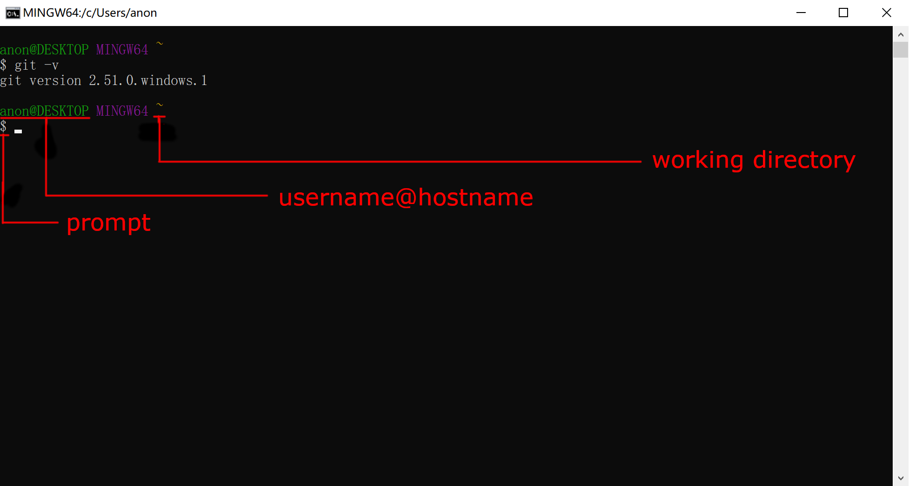
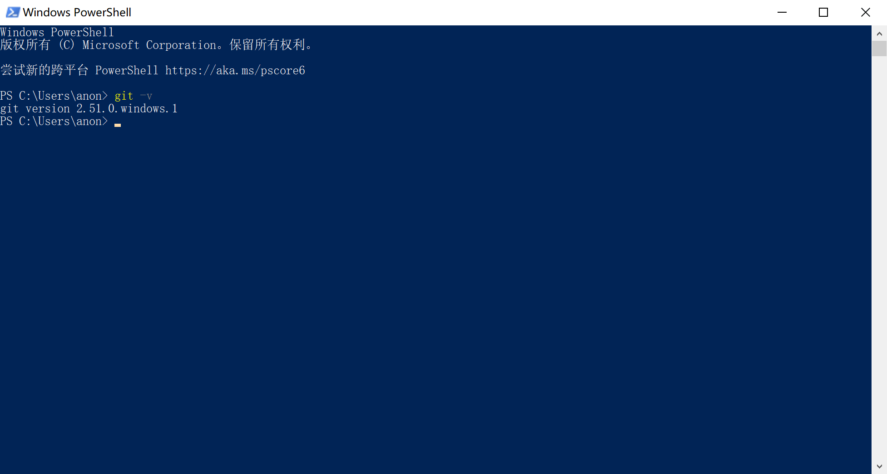

---
title:
  - Git Workshop
author:
  - Tech GC
theme:
  - Copenhagen
date:
  - November 2025
colorlinks: true
linkcolor: .
urlcolor: blue
#aspectratio: 169
header-includes: |
  \setbeamertemplate{headline}{}
  \lstset{basicstyle=\ttfamily,frame=single,frameround=tttt,columns=fullflexible,keepspaces=true,backgroundcolor=\color{yellow!20}}
---

## Contents

\tableofcontents

# Alternatives to Git Workshop

- Google "how to use git", "git tutorial"

- [Pro Git](https://git-scm.com/book/en/v2)

- Ask AI

# Introduction

## The what and the why

- Git is a free and open source distributed version control system

- Famous software developed with Git
  - [Linux](https://github.com/torvalds/linux)

  - [Vim](https://github.com/vim/vim)

  - [Visual Studio Code](https://github.com/microsoft/vscode)

- We learn Git because it's:
  - Required in ENGL1010J and ENGL1510J

  - Useful for version control

  - Useful for project collaboration

## Surprising use of Git

- [pass](https://www.passwordstore.org/): a password manager using Git to track and sync passwords

- [sindresorhus/awesome](https://github.com/sindresorhus/awesome): an online Git repository sharing educational material

- Today, we're gonna build an SJTU Survival Guide with Git

# Shell 101

## What is shell

- Command interpreters, allowing users to give commands to their OS

- A layer between system function calls and the user

- In particular, we use shell in this workshop to send Git commands to our OS

- A few conventions: Monospace is used for commands and code. Brackets ([]) surround optional arguments, angle brackets (<>) surround mandatory arguments, vertical bars (|) separate choices, and ellipses (...) can be repeated.

## Different kinds of shell

- Identify the type of your Git installation and its corresponding shell

| Installation type | Shell                  |
| ----------------- | ---------------------- |
| Windows native    | Git Bash or Powershell |
| WSL               | WSL Shell              |
| Dual-boot         | Linux Shell            |

- We use Git Bash as exmample in this workshop. WSL shell and Linux shell are pretty similar

## Git Bash UI



## Powershell UI



## Directories and paths

- Git Bash uses slashes (`/`) as directory delimiters. So do WSL shell and Linux shell

- Git Bash on Windows is case-insensitive, so is WSL shell. Linux shell is case-sensitive

- Working directory is the directory you're currently in

## Common directories

<!--prettier-ignore-->
| Description                  | Representation                                                  |
| ---------------------------- | --------------------------------------------------------------- |
| Home directory               | `~`                                                             |
| Root directory               | `/`                                                             |
| Drive directories (Windows)  | `/c/`, `/d/`, ... in Git Bash; `/mnt/c/`, `/mnt/d/`, ... in WSL |

- `~` mirrors to `C:\Users\<USERNAME>` on Windows

- In Git Bash, `/` mirrors to Git installation path on Windows

## Relative directories

<!--prettier-ignore-->
| Description       | Representation |
| ----------------- | -------------- |
| Current directory | `.` |
| Parent directory | `..` |

- These directories can appear anywhere in a path

- When appearing first in a path, these are relative to the current working directory

- E.g. `/a/b/./c` is the same as `/a/b/c`, and `/a/b/../c` is the same as `/a/c`

- E.g. If you're in `~/a/b`, then `../c` is the same as `~/a/c`

## Basic shell commands

\small

<!--prettier-ignore-->
| Command                      | Action                                                                |
| ---------------------------- | --------------------------------------------------------------------- |
| `cd [DIRECTORY]`             | Change working directory to `DIRECTORY`, or home directory by default |
| `pwd`                        | Print working directory                                               |
| `ls [OPTION]...` `[DIRECTORY]` | List information about `DIRECTORY`, or current directory by default   |
| Option `-a`                  | Do not ignore entries starting with `.`                               |
| Option `-l`                  | Use a long listing format                                             |
| `touch <FILE>`               | Create the `FILE` if it doesn't exist                                 |
| `mkdir <DIRECTORY>`          | Create `DIRECTORY`                                                    |
| `cp <SOURCE> <DEST>`         | Copy `SOURCE` to `DEST`                                               |
| `cp <SOURCE>` `<DIRECTORY>`    | Copy `SOURCE` to `DIRECTORY`                                          |

\normalsize

## Basic shell commands

Cont.

\small

<!--prettier-ignore-->
| Command                      | Action                                                                |
| ---------------------------- | --------------------------------------------------------------------- |
| `mv <SOURCE> <DEST>`         | Rename `SOURCE` to `DEST`                                             |
| `mv <SOURCE>` `<DIRECTORY>`    | Move `SOURCE` to `DIRECTORY`                                          |
| `rm [OPTION]...` `<FILE>`      | Remove `FILE`. It does not remove directories by default              |
| Option `-r`                  | Remove directories and their contents recursively                     |

\normalsize

- Use `COMMAND -h` or `COMMAND --help` to get more information, or google "COMMAND man page"

## Invoke text editors in shell

- VS Code: use `code <FILE>` to open `FILE`, or `code <DIRECTORY>` to open `DIRECTORY` in VS Code. VS Code should be added to `PATH` environment variable on Windows. Follow the guide [for Windows 10](https://stackoverflow.com/questions/44272416/add-a-folder-to-the-path-environment-variable-in-windows-10-with-screenshots) or [for Windows 11](https://superuser.com/questions/1861276/how-to-set-a-folder-to-the-path-environment-variable-in-windows-11). Note that you'll have to reopen Git Bash after this

- Notepad: use `notepad <FILE>` to open `FILE` in Notepad

## Tips

- Right-click to paste in Git Bash

- If Ctrl+V doesn't work, use Ctrl+Shift+V to paste in WSL shell

## Outlook

- There are more advanced topics in shell that will not be covered in this workshop, such as command chaining and shell scripting

- For those who are interested, there's [a very nice guide](https://mywiki.wooledge.org/BashGuide) accompanied with [Bash Pitfalls](https://mywiki.wooledge.org/BashPitfalls) for Bash, a widely used shell on Linux

## Practice

- Technically, `cd` is the only command that's absolutely necessary for this workshop. Everything else can be done on File Explorer. Nevertheless, try to learn the commands as you'll need them in the future

- Create folder `~/Survive-SJTU` and create a file named `README.md` in it. Then write a few pieces of survival guide in it. You may want to follow [the Markdown syntax](https://daringfireball.net/projects/markdown/syntax)

# Git configuration

- Pro Git p. 20 "First-Time Git Setup"

- `git config --global user.name <NAME>`

- `git config --global user.email <EMAIL>`

- Enclose `NAME` in double quotes if it contains spaces

- For [focs](https://focs.ji.sjtu.edu.cn/git/), `EMAIL` must be your SJTU email

- Refer to Pro Git p. 478 if you need to change the text editor Git uses. We recommend VS Code or Notepad

# Get your hands dirty

## The starting point - repository

A repository is:

- a central storage location for a project's files and their complete revision history

- stored in a `.git` folder in your project root directory

## How to create a repository

**Create a repository = Create a standardized `.git` folder**

- Use `git init` in local existing project directory

- Use `git clone` to copy a remote (i.e. stored on a server) directory with all its files and histories (i.e. its `.git` folder) to your local computer

\small

| Command                       | Function                     |
| ----------------------------- | ---------------------------- |
| `git clone <repository-url>`  | Basic cloning                |
| `git clone <url> <dir>`       | Clone to specified directory |
| `git clone -b <branch> <url>` | Clone a specific branch      |

\normalsize

**Reminder:** Clone will automatically set the remote, so you needn't connect to the remote repo again after cloning.

## The three zones

\center

```{.mermaid caption="The three zones" format=pdf width=300}
sequenceDiagram
    participant wd as Working Directory
    participant sa as Staging Area
    participant repo as Repository
    repo->>wd: Checkout the project
    wd->>sa: Stage Fixes
    sa->>repo: Commit
```

- Working directory: "Ready", status quo of files on your computer

- Staging area: "Set", files to be committed

- Repository: "Go", snapshot permanently stored and **immutable**

## The four states

\center

```{.mermaid caption="Four states of a file" format=pdf width=300}
sequenceDiagram
    participant ut as Untracked
    participant um as Unmodified
    participant m as Modified
    participant s as Staged
    ut->>s: Add the file
    um->>m: Edit the file
    m->>s: Stage the file
    um->>ut: Remove the file
    s->>um: Commit
```

- Untracked: files Git has yet to know about

- Unmodified: files that haven't been modified since last snapshot (can also be called committed from a different POV)

- Modified: files that have been modified but not staged

- Staged: files that are modified and marked to be included in the next snapshot

## How to move files between these zones and states

\small

<!--prettier-ignore-->
| Command                       | Description                                            |
| ----------------------------- | -------------------------------------- |
| `git add <file>`              | Add file to staging area                               |
| `git restore --staged` `<file>` | Remove file from staging area                          |
| `git commit -m <message>`     | Commit (i.e. Take a snapshot of) files in staging area |

\normalsize

## Additional Git Commands

\small

<!--prettier-ignore-->
| Command                  | Description                                           |
| ------------------------ | ---------------------------------------------- |
| `git status`             | Show current status of files in working directory     |
| `git log`                | Show commit history                                   |
| `git diff`               | Show changes between commits, commit and working tree |
| `git diff --staged`      | Show changes between staging area and last commit     |
| \footnotesize`git checkout -- <file>`\small | Discard changes in working directory                  |
| `git reset HEAD <file>`  | Unstage files from staging area                       |

\normalsize

## `git add`

\footnotesize

- Add the file changes in the working directory to the staging area, preparing for the next submission

- General Inputs

<!--prettier-ignore-->
| Command              | Function                                                  |
| -------------------- | -------------------------------------- |
| `git add <file>`     | Stage a specific file                                     |
| `git add .`          | Stage all changes in current directory and subdirectories |
| `git add -A/--all`   | Stage all changes in entire working tree                  |
| `git add -p/--patch` | Interactively choose chunks of changes to stage           |

- Description
  This command is a crucial step in the Git workflow, moving changes from the working directory to the staging area!

\normalsize

## `git commit`

- Save the changes in the staging area to the version repository and create a new commit record

- General Input

\small

<!--prettier-ignore-->
| Command               | Function                                                     |
| --------------------- | ------------------------------------------ |
| `git commit -m "msg"` | Commit directly and add the commit information               |
| `git commit`          | Open the text editor to write multiserial commit information |
| `git commit -a`       | Submit the modifications of all tracked files                |
| `git commit -v`       | Display the distinctions in the text editor                  |

\normalsize

## Commit message

\small

- Format

\footnotesize

```
<type>[scope]: <description>
```

\small

- Usage Examples

\scriptsize

<!--prettier-ignore-->
| Description                           | Example (with type)                                      |
| --------------- | ----------------------------------- |
| A new feature                         | `git commit -m "feat: implement dark mode` `toggle"`       |
| Bug fix                               | `git commit -m "fix: correct calculation in` `cart total"` |
| Documentation changes                 | `git commit -m "docs: add installation guide"`           |
| Code style changes (formatting, etc.) | `git commit -m "style: fix indentation in` `components"`   |
| Code refactoring (no feature for fix) | `git commit -m "refactor: extract payment service"`      |
| Test-related changes                  | `git commit -m "test: add e2e tests for checkout"`       |
| Maintenance tasks, tooling changes    | `git commit -m "chore: update eslint configuration"`     |

\normalsize

## **`git status`**

- Display the current status of the working directory and staging area, including which files have been modified, staged or untracked

- General Inputs

\small

| Command         | Function                            |
| --------------- | ----------------------------------- |
| `git status`    | Basic usage                         |
| `git status -s` | Short format output                 |
| `git status -b` | Display the information of a branch |
| `git status -v` | Display detailed "diff" information |

## **`git status`**

- Short Format Status Codes Appendix

| Code | Meaning         |
| ---- | --------------- |
| `M`  | Modified        |
| `A`  | New file staged |
| `??` | Untracked file  |
| `D`  | Delete file     |
| `R`  | Renamed file    |
| `C`  | Copied file     |

## `git status`

- Explanation of the status area

<!--prettier-ignore-->
| Status Area                   | Corresponding actions                                  |
| ----------------------------- | ----------------------------------- |
| Changes to be committed       | `git restore --staged` to unstage                      |
| Changes not staged for commit | `git add` to stage or `git restore` to discard changes |
| Untracked files               | `git add` to start tracking                            |

\normalsize

## `git diff`

\small

- Display the differences among the working directory, staging area, and commit

- Sample Input & Output

- Input :\
  `git diff`

- Output :

```diff
diff --git a/example.js b/example.js
index 1234567..89abcde 100644
--- a/example.js
+++ b/example.js
@@ -2,5 +2,5 @@ function example() {
   let message = "Hello";
-  console.log("Old message");
+  console.log("New message");
   return message;
 }
```

- Description

This command is a powerful tool for code review and debugging!

\normalsize

## `git log`

- View the submission history


- “HEAD -> master”: You are currently in the master branch.
- “origin/master”: Your local master branch is synchronized with the master branch of the remote repository.
- You need to use `git add` and `git commit` first before you can view the logs.

# About branches

## What are branches?

Branches are:

- Different paths the codebase will grow on

- Isolated histories that don't interfere with each other

- Used to separate different feature changes and on-going fixes

The branches can be visualized by a tree-like structure.

Use `git log` to see a graph of this tree-like structure.
\small

```sh
git log --graph --no-color --pretty=oneline --abbrev-commit
```

\normalsize

## And why are branches important?

- Cleaner working tree without disturbance from other changes

- Safer environment in case something devastating happens

- Parallel development to maximize productivity

## Working with branches

<!--prettier-ignore-->
|Command|Description|
|----|-------|
|`git branch <name>`|Create a branch with `name`|
|`git checkout <name>`|Switch current branch to `name`|
|`git merge <from>`|Merge commits from other branches to the current one|
|`git rebase <from>`|Rebase current branch on another one|

## Practice

Create a branch structure like this in your Survival Guide repository:

```
          G---H---I (fix-grammar)
         /
        F (new-point-a)
       /
      /       J---K (new-point-b)
     /       /
A---B---C---D---E (master)
```

## Merge vs. Rebase

Branches can be merged or rebased together to combine changes from multiple sources.

**Merge**

```
      E---F---G (fix)            E---F---G (fix)
     /                 ==>      /         \
A---B---C---D (master)     A---B---C---D---H (master)
```

- `H` is a new commit containing all files' latest snapshots from `E`, `F` and `G`.
- Keeps complete historical records.
- Non destructive operation.

## Merge vs. Rebase

Branches can be merged or rebased together to combine changes from multiple sources.

**Rebase**

\small

```
      E---F (fix)                E---F (fix)
     /                 ==>      /
A---B---C---D (master)     A---B---E'---F'---C---D (master)
```

\normalsize

- `E'` has the same snapshot as `E`, `F'` has the same snapshot as `F`
- Creates linear history and rewrite commit history.

## What's this 'fast-forward' thing?

**Merge** (without fast-forward)
\small

```
      C---D---E (fix)            C---D---E (fix)
     /                ==>       /         \
A---B (master)             A---B-----------F (master)
```

\normalsize

- `F` is a new commit.

**Merge** (with fast-forward)

\small

```
      C---D---E (fix)
     /                ==>
A---B (master)             A---B---C---D---E (master & fix)
```

\normalsize

- No new commit is created.

## Practice

Extend the previous branch structure to this:

```
         F---G---H---I---- (new-point-a & fix-grammar)
        /                 \
       /                   \
      /       J---K (new-point-b)
     /       /               \
A---B---C---D---E---J'---K'---L (master)
```

## What is `HEAD`

`HEAD` is:

- A special pointer in your repository that points to the commit your current work is based on

- Useful when performing some commands

# Remote repositories

## What are remote repositories?

- Versions of your project hosted on the web (GitHub, GitLab, Bitbucket, self-hosted, etc.)

- Can serve as your code backup

- Multiple developers can collaborate on the same project

## Common remote operations

\small

<!--prettier-ignore-->
| Command                       | Description                                        |
| ----------------------------------- | -------------------------------------------- |
| `git remote add <name> <url>` | Add a remote repository                            |
| `git remote -v`               | List remote repositories                           |
| `git push [remote] [branch]`  | Upload local commits to a remote repository        |
| `git pull [remote] [branch]`  | Download and merge from a remote repository        |
| `git fetch [remote]`          | Download objects and refs from a remote repository |

\normalsize

### Popular Git hosting platforms

\small

- **GitHub**: Most popular platform, owned by Microsoft
- **GitLab**: Offers both cloud and self-hosted solutions
- **Bitbucket**: Popular among enterprise users, owned by Atlassian
- **FOCS Git**: The internal GC Git platform
  \normalsize

## Practice

Create a remote repository on [FOCS Git](https://focs.ji.sjtu.edu.cn/git) and push your Survival Guide to it.

# Solving conflicts in Git

## What is a merge conflict?

A merge conflict occurs when Git cannot automatically reconcile differences between two commits during a merge operation.

This typically happens when the same lines in the same file have been modified in different branches that are being merged.

## How to identify a conflict

When a merge conflict occurs, Git will:

1. Mark the conflicted files as "unmerged"

2. Insert conflict markers (`<<<<<<<`, `=======`, `>>>>>>>`) directly into the affected files

3. Report which files have conflicts

**NOTE:** Check the status with: `git status`

## Understanding conflict markers

When you open a conflicted file, you'll see sections like this:

```
<<<<<<< HEAD
This is the content from the current branch
=======
This is the content from the branch being merged
>>>>>>> branch-name
```

The content between `<<<<<<< HEAD` and `=======` is from your current branch.

The content between `=======` and `>>>>>>> branch-name` is from the branch you're merging.

## Steps to resolve a conflict

\small

1. Identify conflicted files using `git status`

2. Open each conflicted file and look for conflict markers (`<<<<<<<`, `=======`, `>>>>>>>`)

3. Edit the file to resolve the conflict by:

\vspace{-12pt}

- Deciding which changes to keep (from either branch or a combination)

- Removing the conflict markers (`<<<<<<<`, `=======`, `>>>>>>>`)

- Making any additional changes needed to properly integrate the code

\vspace{-12pt}

4. Add the resolved files to the staging area:

\vspace{-12pt}

- Use `git add <filename>` or `git add .` to stage all resolved files

\vspace{-12pt}

5. Complete the merge:

\vspace{-12pt}

- `git commit -m "Resolve merge conflict in <filename>"`

\normalsize

## Practical example

Let's say we have a conflict in `README.md`:

```
# My Project
<<<<<<< HEAD
This is the main branch content
=======
This is the feature branch content
>>>>>>> feature-branch
```

After deciding which content to keep (or combining both), the resolved file should look like:

```
# My Project
This is the content I want to keep
```

## Tips for conflict resolution

- Use a text editor with syntax highlighting to better see conflict markers

- Some editors have special features for visualizing and resolving conflicts

- Communicate with team members when you're unsure which changes to keep

- Test your code after resolving conflicts to ensure everything still works

- Use `git diff` to review what you've changed before committing

- Consider using `git merge-tool` for complex conflicts

## Common tools for resolving conflicts

- **VS Code**: Has built-in conflict resolution interface

- **Vim**: Use `:Gdiff` with vim-fugitive plugin

- **Dedicated tools**: `meld`, `p4merge`, `bc` (Beyond Compare)

# Other common Git issues and troubleshooting

## Common issues

**1. Forgot to stage files before committing:**

- Error: `nothing to commit, working tree clean`
- Solution: Use `git add <filename>` to stage files, then commit again

**2. Made a mistake in the commit message:**

- Solution: `git commit --amend -m "corrected message"` to update the last commit message

**3. Forgot to add a file to the last commit:**

- Solution: Add the file with `git add <filename>`, then use `git commit --amend` to include it in the previous commit

**4. Accidentally modified the wrong branch:**

- Solution: Use `git stash` to save changes, switch to correct branch, then `git stash pop` to apply changes there

## Common issues

**5. Conflicts during merge:**

- Solution: Manually edit conflicted files to resolve conflicts (look for `<<<<<<<`, `=======`, `>>>>>>>` markers), then add and commit the resolved files

**6. How to undo things:**

- To unstage a file: `git restore --staged <file>`
- To discard changes in working directory: `git restore <file>`
- To go back to a previous commit: `git reset --hard <commit-hash>` (**WARNING:** This is destructive!)

## Undoing changes in Git

Git provides several ways to undo changes depending on where you are in the workflow:

### Undoing changes in the Working Directory

\vspace{-8pt}

`git restore <file>` (or `git checkout -- <file>` in older Git versions)

### Unstaging a file

\vspace{-8pt}

`git restore --staged <file>` (or `git reset HEAD <file>` in older Git versions)

## Undoing Changes in Git

### Undoing commits (locally only!)

\vspace{-8pt}

**Soft Reset**: Moves the branch pointer back but keeps changes in staging area

\footnotesize

::: columns
:::: {.column width=8%}
::::
:::: {.column width=20%}

\centering

Before:

```
A---B---C
        ^
      HEAD
```

::::
:::: {.column width=64%}

\centering

After `git reset --soft HEAD~1`:

```{.lstlisting framexleftmargin=-7em framexrightmargin=-7em}
               A---B---C
                   ^
                 HEAD
```

::::
:::: {.column width=8%}
::::
:::

\begin{center}(\lstinline|C|'s changes in staging area)\end{center}

\normalsize

**Mixed Reset**: Moves the branch pointer back and keeps changes in working directory

\footnotesize

::: columns
:::: {.column width=8%}
::::
:::: {.column width=20%}

\centering

Before:

```
A---B---C
        ^
      HEAD
```

::::
:::: {.column width=64%}

\centering

After `git reset --mixed HEAD~1`:

```{.lstlisting framexleftmargin=-7em framexrightmargin=-7em}
               A---B---C
                   ^
                 HEAD
```

::::
:::: {.column width=8%}
::::
:::

\begin{center}(\lstinline|C|'s changes in working directory)\end{center}

\normalsize

## Undoing Changes in Git

### Undoing commits (locally only!)

\vspace{-8pt}

**Hard Reset**: Moves the branch pointer back and discards all changes

\footnotesize

::: columns
:::: {.column width=8%}
::::
:::: {.column width=20%}

\centering

Before:

```
A---B---C
        ^
      HEAD
```

::::
:::: {.column width=64%}

\centering

After `git reset --hard HEAD~1`:

```{.lstlisting framexleftmargin=-8em framexrightmargin=-8em}
                 A---B
                     ^
                   HEAD
```

::::
:::: {.column width=8%}
::::
:::

\begin{center}(\lstinline|C|'s changes discarded)\end{center}

\normalsize
