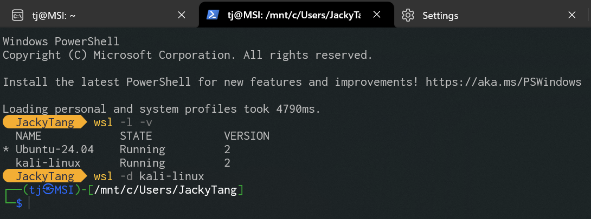
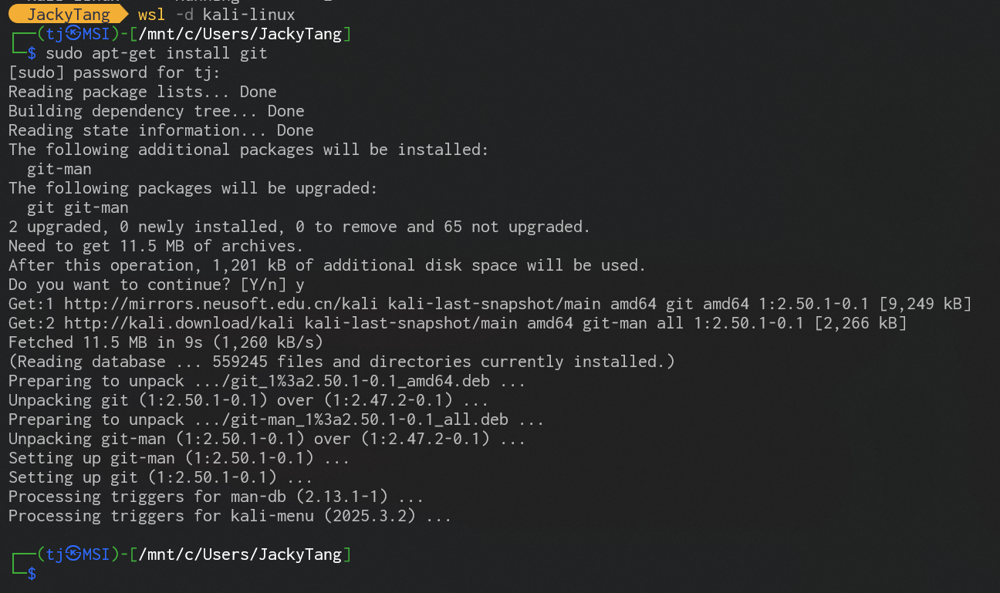
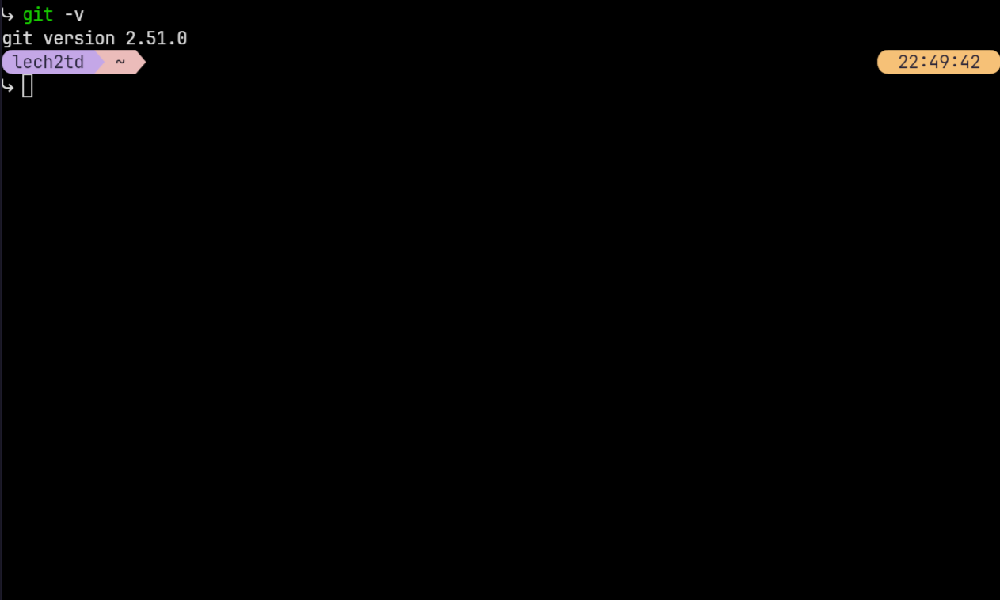

---
title:
  - Git Workshop
author:
  - Tech GC
theme:
  - Copenhagen
date:
  - November 2025
colorlinks: true
linkcolor: .
urlcolor: blue
aspectratio: 169
header-includes: |
  \setbeamertemplate{headline}{}
---

\tableofcontents

# The what and why

## The what and why

- Git is a free and open source distributed version control system

- Famous software developed with Git
  - [Linux](https://github.com/torvalds/linux)
  - [Vim](https://github.com/vim/vim)
  - [Visual Studio Code](https://github.com/microsoft/vscode)

- We learn Git because it's:
  - Required in ENGL1010J and ENGL1510J
  - Useful for version control
  - Useful for project collaboration

# Basic shell

## What is a shell

- A command dispatcher/process starter

- A more advanced and direct interface with the OS

- Gets you more productive

## Working with files and directories in a shell

- **Forward slashes** (i.e. "`/`") for separating directories

- One uniformed tree-like structure (non-Windows environment)

- Working directory

## Common directories

<!--prettier-ignore-->
| Description                  | Representation                                                  |
| ---------------------------- | ----------------------------------- |
| Home directory               | `~`                                                             |
| Root directory (non-Windows) | `/`                                                             |
| Drive directories (Windows)  | `/c/`, `/d/`, ... in Git Bash; `/mnt/c/`, `/mnt/d/`, ... in WSL |

`~` redirects to:

- `C:\Users\<username>` on Windows native
- `/home/<username>` on macOS/Linux

## Shell commands

\small

<!--prettier-ignore-->
| Command                     | Action                                                             |
| --------------------------- | --------------------------------------- |
| `cd [directory]`            | Change working directory                                           |
| `pwd`                       | Print working directory                                            |
| `ls [options] [directory]`  | List directory contents                                            |
| `touch <file>`              | Create a file (if it doesn't exist)                                |
| `mkdir <directory>`         | Make (i.e. "Create") a directory                                   |
| `mv <source> <destination>` | Move files/directories from `source` to `destination` |
| `cp <source> <destination>` | Copy files/directories from `source` to `destination` |
| `rm <file>`                 | Remove (i.e. Permanently delete) a file                            |

\normalsize

Further description can be found by executing `man <command>` in non-Windows shell or search online for **manpages**.

## Practice

Exercise 1: Create a file structure like this:

```
~
|- git-wksp
   |
   |- exercise-1
   |  |
   |  |- question-1
   |
   |- exercise-2
```

**Step-by-step instructions:**
1. Navigate to your home directory: `cd ~`
2. Create the main folder: `mkdir git-wksp`
3. Enter the folder: `cd git-wksp`
4. Create exercise-1 directory: `mkdir exercise-1`
5. Create exercise-2 directory: `mkdir exercise-2`
6. Enter exercise-1: `cd exercise-1`
7. Create question-1: `touch question-1`
8. Verify: `ls -la`

Exercise 2: Advanced file management
1. Create multiple directories at once: `mkdir -p project/{src,docs,tests}`
2. Copy a file: `cp question-1 ../exercise-2/new-question-1`
3. Move a file: `mv ../exercise-2/new-question-1 .`
4. Remove a file: `rm question-1`
5. List all files recursively: `find . -type f`

# Get ready for your first repository

## Installing Git

### Switch to WSL

### Windows
1. Download Git from [git-scm.com](https://git-scm.com/download/win)
2. Run the installer with default settings
3. Choose your preferred text editor (Vim, VS Code, etc.)
4. Choose terminal emulator (Git Bash is recommended)
5. Complete the installation

### macOS
1. Install Xcode command line tools: `xcode-select --install`
2. Or install using Homebrew: `brew install git`

### Linux (Ubuntu/Debian)
- Install using package manager: `sudo apt-get install git`

### Linux (CentOS/RHEL/Fedora)
- Install using package manager: `sudo yum install git` or `sudo dnf install git`



## Identify your Git environment

| Installation type | Recommended Shell   |
| ----------------- | ------------------- |
| Windows native    | Powershell/Git Bash |
| WSL               | Bash/Zsh            |
| Linux native      | Bash/Zsh            |

NOTE: It's best suggested that you add which directory the `git` executable file is in to your `PATH` environment variable.

## Identify your environment


## Identify your environment


## Identify your environment




## Git configuration

- `git config --global user.name <NAME>`

- `git config --global user.email <EMAIL>`

- Enclose `NAME` in double quotes if it contains spaces

- For [FOCS Git](https://focs.ji.sjtu.edu.cn/git/), `EMAIL` must be your SJTU email

# Get your hands dirty

## The starting point - repository

A repository is:

- a central storage location for a project's files and their complete revision history

- stored in a `.git` folder in your project root directory

## How to create a repository

**Create a repository = Create a standardized `.git` folder**

- `git init` in local existing project directory

- `git clone <url>` to copy a remote (i.e. stored on a server) directory with all its files and histories (i.e. its `.git` folder) to your local computer

## The three zones

{ width=300px }

- Working directory: "Ready", status quo of files on your computer

- Staging area: "Set", files to be committed

- Repository: "Go", snapshot permanently stored and **immutable**

## The four states

{ width=300px }

- Untracked: files Git has yet to know about

- Unmodified: files that haven't been modified since last snapshot (can also be called committed from a different POV)

- Modified: files that have been modified but not staged

- Staged: files that are modified and marked to be included in the next snapshot

## How to move files between these zones and states

| Command                       | Description                                            |
| ----------------------------- | ------------------------------------------------------ |
| `git add <file>`              | Add file to staging area                               |
| `git restore --staged <file>` | Remove file from staging area                          |
| `git commit -m <message>`     | Commit (i.e. Take a snapshot of) files in staging area |

## Additional Git Commands

| Command                         | Description                                            |
| ------------------------------- | ------------------------------------------------------ |
| `git status`                    | Show current status of files in working directory      |
| `git log`                       | Show commit history                                    |
| `git diff`                      | Show changes between commits, commit and working tree  |
| `git diff --staged`             | Show changes between staging area and last commit      |
| `git checkout -- <file>`        | Discard changes in working directory                   |
| `git reset HEAD <file>`         | Unstage files from staging area                        |

## Remote repositories

Working with remote repositories allows you to collaborate with others and backup your code.

### What are remote repositories?

- Remote repositories are versions of your project hosted on the Internet or network
- They can be on platforms like GitHub, GitLab, Bitbucket, etc.
- Multiple developers can collaborate on the same project

### Common remote operations

| Command                              | Description                                               |
| ------------------------------------ | --------------------------------------------------------- |
| `git remote add <name> <url>`        | Add a remote repository                                   |
| `git remote -v`                      | List remote repositories                                  |
| `git push <remote> <branch>`         | Upload local commits to a remote repository               |
| `git pull <remote> <branch>`         | Download and merge from a remote repository               |
| `git fetch <remote>`                 | Download objects and refs from a remote repository        |

### Popular Git hosting platforms:

- **GitHub**: Most popular platform, owned by Microsoft
- **GitLab**: Offers both cloud and self-hosted solutions
- **Bitbucket**: Popular among enterprise users, owned by Atlassian
- **FOCS Git**: The internal SJTU Git platform mentioned in this workshop

# About branches

## What are branches?

Branches are:

- Different paths the codebase will grow on

- Isolated histories that don't interfere with each other

- Used to separate different feature changes and on-going fixes

The branches can be visualized by a tree-like structure.

Type `git log --graph --no-color --pretty=oneline --abbrev-commit` to see a graph of this tree-like structure.

## And why are branches important?

- Cleaner working tree without disturbance from other changes

- Safer environment in case something devastating happens

- Parallel development to maximize productivity

## Working with branches

<!--prettier-ignore-->
|Command|Description|
|----|-------|
|`git branch <name>`|Create a branch with `name`|
|`git checkout <name>`|Switch current branch to `name`|
|`git merge <from-branch>`|Merge commits from other branches to the current one|
|`git rebase <from-branch>`|Rebase current branch on another one|

## Practice

Create a branch structure like this:

```
          G---H---I (fix)
         /
        E---F (feature-a)
       /
      /       J---K (feature-b)
     /       /
A---B---C---D---E (master)
```

## Merge vs. Rebase

Branches can be merged or rebased together to combine changes from multiple sources.

**Merge**

```
      E---F---G (fix)              E---F---G (fix)
     /                  ==>       /         \
A---B---C---D (master)       A---B---C---D---H (master)
```

- `H` is a new commit containing all files' latest snapshots from `E`, `F` and `G`.
- Keep complete historical records.
- Non destructive operation.

**Rebase**

```
      E---F---G (fix)              E---F---G (fix)
     /                  ==>       /
A---B---C---D (master)       A---B---E'---F'---G'---C---D (master)
```

- `E'` has the same snapshot as `E`, `F'` has the same snapshot as `F`, ...
- Create linear history and Rewrite submission history.

## What's this 'fast-forward' thing?

**Merge** (without fast-forward)

```
      C---D---E (fix)             C---D---E (fix)
     /                 ==>       /         \
A---B (master)              A---B-----------F (master)
```

- `F` is a new commit.

**Merge** (with fast-forward)

```
      C---D---E (fix)
     /                 ==>
A---B (master)              A---B---C---D---E (master & fix)
```

- No new commit is created.

## Practice

Extend the previous branch structure to this:

```
         E---F---G---H---I (feature-a & fix)
        /                 \
       /                   \
      /       J---K (feature-b)
     /       /               \
A---B---C---D---E---J'---K'---M (master)
```

## Common Git Errors and Troubleshooting

### Common Issues:

**1. Forgot to stage files before committing:**
   - Error: `nothing to commit, working tree clean`
   - Solution: Use `git add <filename>` to stage files, then commit again

**2. Made a mistake in the commit message:**
   - Solution: `git commit --amend -m "corrected message"` to update the last commit message

**3. Forgot to add a file to the last commit:**
   - Solution: Add the file with `git add <filename>`, then use `git commit --amend` to include it in the previous commit

**4. Accidentally modified the wrong branch:**
   - Solution: Use `git stash` to save changes, switch to correct branch, then `git stash pop` to apply changes there

**5. Conflicts during merge:**
   - Solution: Manually edit conflicted files to resolve conflicts (look for `<<<<<<<`, `=======`, `>>>>>>>` markers), then add and commit the resolved files

**6. How to undo things:**
   - To unstage a file: `git restore --staged <file>`
   - To discard changes in working directory: `git restore <file>`
   - To go back to a previous commit: `git reset --hard <commit-hash>` (WARNING: This is destructive!)

## Undoing Changes in Git

Git provides several ways to undo changes depending on where you are in the workflow:

### 1. Undoing changes in the Working Directory

Command: `git restore <file>` (or `git checkout -- <file>` in older Git versions)

### 2. Unstaging a file
```
Working Directory     Staging Area     Repository
(unmodified)        (staged file)    (committed)
      |                 |                |
      |           git add file.txt       |
      |        ---------------->         |
      |                 |                |
      |    git restore --staged          |
      |    <file> (undo staging)         |
      |    <------------------           |
```

Command: `git restore --staged <file>` (or `git reset HEAD <file>` in older Git versions)

### 3. Undoing commits (Locally only)

**Soft Reset**: Moves the branch pointer back but keeps changes in staging area
```
Before:      After git reset --soft HEAD~1:
A-B-C        A-B-C
     ^         ^
   HEAD       HEAD
            (B's changes staged)
```

**Mixed Reset**: Moves the branch pointer back and keeps changes in working directory
```
Before:      After git reset --mixed HEAD~1:
A-B-C        A-B-C
     ^         ^
   HEAD       HEAD
            (B's changes in working dir)
```

**Hard Reset**: Moves the branch pointer back and discards all changes
```
Before:      After git reset --hard HEAD~1:
A-B-C        A-B
     ^         ^
   HEAD       HEAD
```

# Beyond this workshop

- Google

- [Pro Git](https://git-scm.com/book/en/v2)

- AI assistant
