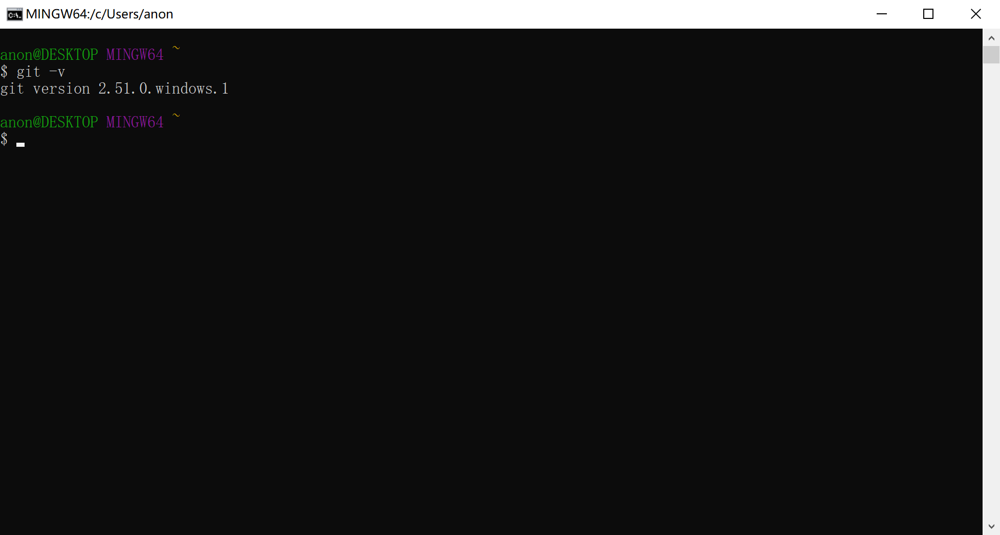
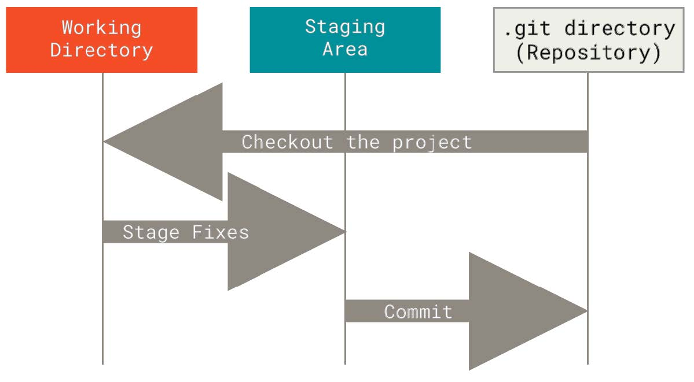
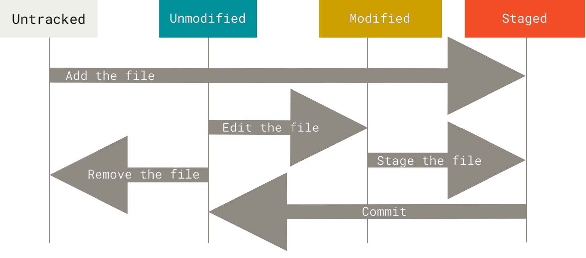

---
title:
- Git Workshop
author:
- Tech JI
theme:
- Copenhagen
date:
- November 2025
colorlinks: true
linkcolor: .
urlcolor: blue
---

# Alternatives to Git Workshop

- Google "how to use git", "git tutorial"
- [Pro Git](https://git-scm.com/book/en/v2)
- Ask AI

# The what and the why

- Git is a free and open source distributed version control system
- Famous software developed with Git
    - [Linux](https://github.com/torvalds/linux)
    - [Vim](https://github.com/vim/vim)
    - [Visual Studio Code](https://github.com/microsoft/vscode)
- We learn Git because it's:
    - Required in ENGL1010J and ENGL1510J
    - Useful for version control
    - Useful for project collaboration

# Surprising use of Git

- [pass](https://www.passwordstore.org/): a password manager using Git to track and sync passwords
- [sindresorhus/awesome](https://github.com/sindresorhus/awesome): an online Git repository sharing educational material
- Today, we're gonna build an SJTU Survival Guide with Git

# Git setup

- It is assumed that you have installed Git already
- Identify the type of your Git installation

| Installation type | Shell |
|-------------------|-------|
| Windows native | Git Bash or Powershell |
| WSL | WSL Shell |
| Dual-boot | Linux Shell |

# Git setup

# Git setup

# Git setup

TODO: image of WSL Shell and Linux Shell

# Shell 101

- Shells may differ greatly from each other. For the sake of simplicity, we only use Git Bash as an example, which is similar to WSL Shell and Linux Shell
- A few conventions: Monospace is used for commands and code. Brackets ([]) surround optional arguments, angle brackets (<>) surround mandatory arguments, vertical bars (|) separate choices, and ellipses (...) can be repeated.

# Shell 101

# Shell 101

- Git Bash paths use slashes. So do WSL Shell and Linux Shell
- Initial `~` stands for the home directory, which, in Git Bash, mirrors to `C:\Users\<USERNAME>` on Windows
- Initial `/` stands for the root directory, which, in Git Bash, mirrors to the Git installation path.
- Additionally, `/c`, `/d`, etc. in Git Bash mirror to `C:`, `D:`, etc. on Windows, respectively
- The above symbols mirror to different locations in WSL Shell and Linux Shell

# Shell 101

- `cd [DIRECTORY]`: change the working directory to `DIRECTORY`. When `DIRECTORY` is omitted, change the working directory to the home directory instead
- `ls [OPTION]... [FILE]...`: List information about the `FILE`s (the current directory by default)
    - `-a`: do not ignore entries starting with .
- `touch <FILE>...`: create the `FILE`(s)
- `mkdir <DIRECTORY>...`: create the `DIRECTORY`(ies)
- `mv <SOURCE> <DEST>`, `mv <SOURCE>... <DIRECTORY>`: Rename `SOURCE` to `DEST`, or move `SOURCE`(s) to `DIRECTORY`
- `cp <SOURCE> <DEST>`, `cp <SOUCRE>... <DIRECTORY>`: Copy `SOURCE` to `DEST`, or multiple `SOURCE`(s) to `DIRECTORY`
- `rm [OPTION]... [FILE]...`: Remove each specified file. By default, it does not remove directories
    - `-r`: remove directories and their contents recursively
- To learn more about the commands, use `COMMAND -h` or `COMMAND --help`

# Shell 101

- If you have installed and added VS Code to the `PATH` environment variable on Windows, you can also use the command `code <FILE>` to open `FILE` in VS Code. If you haven't already, follow the guide [for Windows 10](https://stackoverflow.com/questions/44272416/add-a-folder-to-the-path-environment-variable-in-windows-10-with-screenshots) or [for Windows 11](https://superuser.com/questions/1861276/how-to-set-a-folder-to-the-path-environment-variable-in-windows-11). Note that you'll have to reopen Git Bash after this
- Alternatively, use `notepad <FILE>` to open `FILE` in Notepad
- Technically, `cd` is the only command that's absolutely necessary for this workshop. Everything else can be done on File Explorer. Nevertheless, try to learn the commands since you'll need them in the future
- Practice: create folder `~/Survive-SJTU` and create a file named `README.md` in it. Then write a few pieces of survival guide in it. You may want to follow [the Markdown syntax](https://daringfireball.net/projects/markdown/syntax)

# Git configuration

- Pro Git p. 21 "First-Time Git Setup"
- `git config --global user.name <NAME>`
- `git config --global user.email <EMAIL>`
- Enclose `NAME` in double quotes if it contains spaces
- For [focs](https://focs.ji.sjtu.edu.cn/git/), `EMAIL` must be your SJTU email
- Refer to Pro Git p. 479 if you need to change the text editor Git uses

# Basic Git Workflow

{ width=300px }

- Pro Git p. 16 "The Three States"
- Working directory: "Ready", status quo of files on your computer
- Staging area: "Set", files to be committed
- Repository: "Go", snapshot permanently stored

# Basic Git Workflow

{ width=300px }

- Untracked: files Git has yet to know about
- Unmodified: files that haven't been modified since last snapshot. Also called committed, from a different POV
- Modified: files that have been modified but not staged
- Staged: files that are modified and marked to be included in the next snapshot
