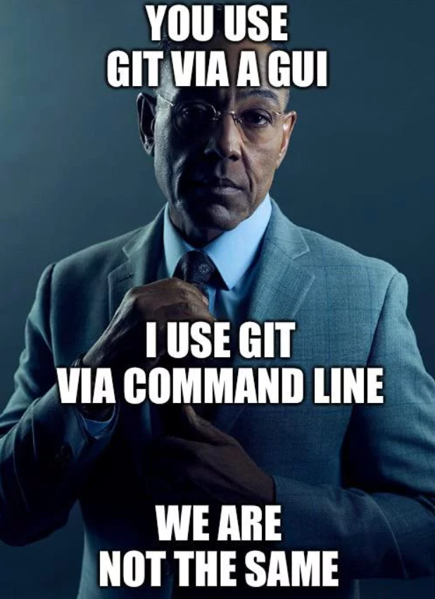
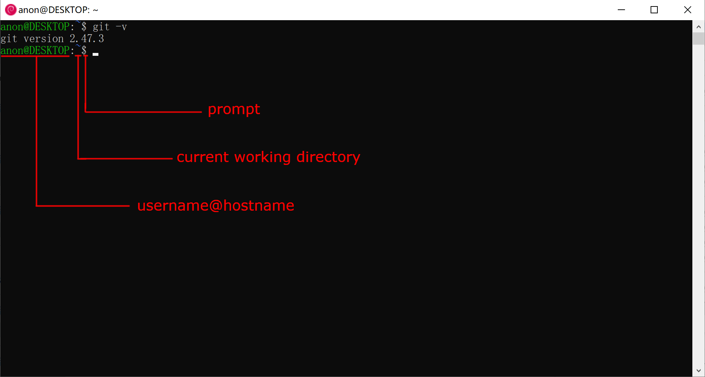
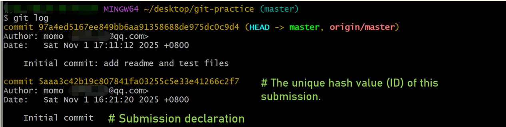

---
title:
  - Git Workshop
author:
  - Tech GC
theme:
  - Copenhagen
date:
  - November 2025
colorlinks: true
linkcolor: .
urlcolor: blue
header-includes: |
  \setbeamertemplate{headline}{}
  \lstset{basicstyle=\ttfamily,frame=single,frameround=tttt,columns=fullflexible,keepspaces=true,backgroundcolor=\color{yellow!20}}
---

## Contents

\tableofcontents

# Introduction

## Alternatives to Git Workshop

- Google "how to use git", "git tutorial"

- [Pro Git](https://git-scm.com/book/en/v2)

- Ask AI

## A personal anecdote

- How Git could have saved me (and you!) an hour's work of Vy100 essay

## The what and the why

- Git is a free and open source distributed version control system

- Famous software developed with Git
  - [Linux](https://github.com/torvalds/linux)

  - [Vim](https://github.com/vim/vim)

  - [Visual Studio Code](https://github.com/microsoft/vscode)

- We learn Git because it's:
  - Required in ENGL1010J and ENGL1510J

  - Useful for version control

  - Useful for project collaboration

## Surprising use of Git

- [pass](https://www.passwordstore.org/): a password manager using Git to track and sync passwords

- [sindresorhus/awesome](https://github.com/sindresorhus/awesome): an online Git repository containing everything you'll ever need to self-study any subject in Computer Science

- It's our turn! GC has a blue tiger mascot right now, but let's get creative. We're gonna design our own ASCII art GC mascot with Git. Template files are at [tests](https://focs.ji.sjtu.edu.cn/git/tests).

## Enter shell

{ width=150px }

- Not so fast! Don't just download the files in your browser. Use shell instead, which leads us to...

# Shell 101

## Shell introduction

- Q: What is shell?

- A: Command interpreters, allowing users to give commands to their OS. A layer between system function calls and the user

- Q: Wait but what does shell have to do with Git workshop?

- A: Because we need shell to send Git (and other) commands to our OS

- Conventions: Monospace for commands and code. Brackets ([]) for optional arguments, angle brackets (<>) for mandatory arguments, vertical bars (|) separate choices, and ellipses (...) can be repeated.

## Different kinds of shell

- Identify the type of your Git installation and its corresponding shell

| Installation type | Shell                  |
| ----------------- | ---------------------- |
| Windows native    | Git Bash or Powershell |
| WSL               | Bash                   |
| Dual-boot Linux   | Bash                   |

- We use WSL and Linux shell as example in this workshop. Git Bash is pretty similar

## WSL shell UI



## Linux shell UI


## Special directories

<!--prettier-ignore-->
| Description                  | Representation                                                  |
| ---------------------------- | --------------------------------------------------------------- |
| Home directory               | `~`                                                             |
| Root directory               | `/`                                                             |
| Drive directories (Windows)  | `/c/`, `/d/`, etc. in Git Bash; `/mnt/c/`, `/mnt/d/`, etc. in WSL |
| Current directory            | `.`                                                             |
| Parent directory             | `..`                                                            |

- `.` and `..` can appear anywhere in a path. When appearing first in a path, they are relative to the current working directory

- E.g. `/a/b/./c` is the same as `/a/b/c`, and `/a/b/../c` is the same as `/a/c`

- E.g. If you're in `~/a/b`, then `../c` is the same as `~/a/c`

## Basic shell commands

\small

<!--prettier-ignore-->
| Command                      | Action                                                                |
| ---------------------------- | --------------------------------------------------------------------- |
| `cd [DIRECTORY]`             | Change working directory to `DIRECTORY`, default: home directory       |
| `ls [-a]` `[-l] [DIRECTORY]` | List files in `DIRECTORY`, default: CWD; -a show hidden files; -l show more info |
| `mkdir <DIRECTORY>`          | Create `DIRECTORY`                                                    |
| `cp <SOURCE> <DEST>`         | Copy `SOURCE` to `DEST`                                               |
| `mv <SOURCE> <DEST>`         | Rename `SOURCE` to `DEST`                                             |
| `mv <SOURCE>` `<DIRECTORY>`  | Move `SOURCE` to `DIRECTORY`                                        |
| `rm [-r] <FILE>`             | Remove `FILE`; -r remove directories                                  |

\normalsize

- More information: use `COMMAND -h`, `COMMAND --help`, `man COMMAND`, or google "COMMAND man page"

## Invoke text editor in shell

- nano: Use `nano <FILE>` (WSL or Linux)

- VS Code: Use `code <FILE | DIRECTORY>`. VS Code should be added to `PATH` environment variable on Windows. Follow the guide [for Windows 10](https://stackoverflow.com/questions/44272416/add-a-folder-to-the-path-environment-variable-in-windows-10-with-screenshots) or [11](https://superuser.com/questions/1861276/how-to-set-a-folder-to-the-path-environment-variable-in-windows-11). Reopen shell after this

- Other text editors: Vim, Emacs, ed, etc.

## Tips

- If Ctrl+V doesn't paste, use Ctrl+Shift+V or right-click to paste in shell

- Tab-completion

## Practice

- Learn from the masters! [cowsay](https://en.wikipedia.org/wiki/Cowsay), [GitHub's mascot octocat](https://api.github.com/octocat), [ASCII Star wars](https://www.asciimation.co.nz/), ["Three ASCII art styles" by Roy/SAC](https://www.roysac.com/roy-sac_styles_of_underground_text_art.html), [inspirations.txt](inspirations.txt)

- Copy and save a few works by others in separate files in `~/git_wksp/inspiration`, using shell. Get some inspiration

## Outlook

- More advanced topics in shell: check out [Bash Guide](https://mywiki.wooledge.org/BashGuide) and [Bash Pitfalls](https://mywiki.wooledge.org/BashPitfalls)

- Shell != Bash: cmd, PowerShell, Bourne shell, dash, csh, zsh, ...

# Git setup

## Git installation

- Windows native: download setup program and double click

- WSL and Linux: use the package manager of your distro. Configure a mirror to increase speed

- Refer to [Git-installation.pdf](Git-installation.pdf) to install Git

## Git config username & email

- `git config --global user.name <NAME>`

- `git config --global user.email <EMAIL>`

## Git config authenticity

- For [FOCS Git](https://focs.ji.sjtu.edu.cn/git/), `EMAIL` must be your SJTU email

{ width=250px }

## Git config text editor & ssh

- Refer to [Pro Git A3.1](https://git-scm.com/book/en/v2/Appendix-C:-Git-Commands-Setup-and-Config) if you need to change the text editor Git uses. We recommend nano and VS Code

- Refer to [ssh_setup.pdf](ssh_setup.pdf) to set up your SSH keys with FOCS

# Get your hands dirty

## The starting point - repository

A repository is:

- a central storage location for a project's files and their complete revision history

- stored in a hidden `.git` folder in your project root directory

## Creating repositories

**Create a repository = Create a standardized `.git` folder**

- **Warning: for each repo, either run `git init` or `git clone`, but never both**

- Use `git init` in local existing project directory

- Use `git clone` to copy a remote directory with all its files and histories to your local computer

\small

| Command                       | Function                     |
| ----------------------------- | ---------------------------- |
| `git clone <repository-url>`  | Basic cloning                |
| `git clone <url> <dir>`       | Clone to specified directory |
| `git clone -b <branch> <url>` | Clone a specific branch      |

\normalsize

## Practice

**Exercise 1: Remote to Local**

Targets:

- Change directory to `~/git_wksp`

- Clone your remote repository to local

## The three zones

\center

```{.mermaid caption="The three zones" format=pdf width=300 height=100 }
sequenceDiagram
    participant wd as Working Directory
    participant sa as Staging Area
    participant repo as Repository
    repo->>wd: Checkout the project
    wd->>sa: Stage Fixes
    sa->>repo: Commit
```

- Working directory: "Ready", current state of local files

- Staging area: "Set", files to be committed

- Repository: "Go", snapshots permanently stored. **Immutable**

- `HEAD`: A special pointer to the current working commit in the repository

## The four states

\center

```{.mermaid caption="Four states of a file" format=pdf width=300}
sequenceDiagram
    participant ut as Untracked
    participant um as Unmodified
    participant m as Modified
    participant s as Staged
    ut->>s: Add the file
    um->>m: Edit the file
    m->>s: Stage the file
    um->>ut: Remove the file
    s->>um: Commit
```

- Untracked: files Git has yet to know about

- Unmodified: files that haven't been modified since last snapshot. Also called committed from a different POV

- Modified: files that have been modified but not staged

- Staged: files that are modified and marked to be included in the next snapshot

## How to move files between these zones and states

\small

<!--prettier-ignore-->
| Command                       | Description                                            |
| ----------------------------- | -------------------------------------- |
| `git add <file>`              | Add file to staging area                               |
| `git restore --staged` `<file>` | Remove file from staging area                          |
| `git commit -m <message>`     | Commit (i.e. Take a snapshot of) files in staging area |

\normalsize

## Additional Git Commands

\small

<!--prettier-ignore-->
| Command                  | Description                                           |
| ------------------------ | ---------------------------------------------- |
| `git status`             | Show current status of files in working directory     |
| `git log`                | Show commit history                                   |
| `git diff`               | Show changes between commits, commit and working tree |
| `git diff --staged`      | Show changes between staging area and last commit     |

\normalsize

## `git add`

\footnotesize

- Add the file changes in the working directory to the staging area, preparing for the next submission

- General Inputs

<!--prettier-ignore-->
| Command              | Function                                                  |
| -------------------- | -------------------------------------- |
| `git add <file>`     | Stage a specific file                                     |
| `git add <dir>`          | Stage all changes in \<dir\> and subdirectories |

\normalsize

## `git commit`

- Save the changes in the staging area to the version repository and create a new commit record

- General Input

\small

<!--prettier-ignore-->
| Command               | Function                                                     |
| --------------------- | ------------------------------------------ |
| `git commit -m "msg"` | Commit directly and add the commit information               |
| `git commit`          | Open the text editor to write multiserial commit information |
| `git commit -a`       | Submit the modifications of all tracked files                |

\normalsize

## Commit message

\vspace{-6pt}

```
<type>[scope]: <description>
```

\small

\vspace{-12pt}

- Usage Examples

\vspace{-12pt}

\scriptsize

<!--prettier-ignore-->
| Description                           | Example (with type)                                      |
| --------------- | ----------------------------------- |
| A new feature                         | `git commit -m "feat: implement dark mode` `toggle"`       |
| Bug fix                               | `git commit -m "fix: correct calculation in` `cart total"` |
| Documentation changes                 | `git commit -m "docs: add installation guide"`           |
| Code style changes                    | `git commit -m "style: fix indentation in` `components"`   |
| Refactor code structure               | `git commit -m "refactor: extract payment service"` |
| Test-related changes                  | `git commit -m "test: add e2e tests for checkout"` |
| Maintenance tasks, tooling changes    | `git commit -m "chore: update eslint configuration"` |

\small

\vspace{-12pt}

- More information: [conventional commits](https://www.conventionalcommits.org/en/v1.0.0/) and [its cheatsheet](https://gist.github.com/qoomon/5dfcdf8eec66a051ecd85625518cfd13)

\normalsize

## **`git status`**

- Display the current status of the working directory and staging area, including which files have been modified, staged or untracked

- General Inputs

\small

| Command      | Function             |
| ------------ | -------------------- |
| `git status` | Show status of files |

## `git status`

- Explanation of the status area

<!--prettier-ignore-->
| Status Area                   | Corresponding actions                                  |
| ----------------------------- | ----------------------------------- |
| Changes to be committed       | `git restore --staged` to unstage                      |
| Changes not staged for commit | `git add` to stage or `git restore` to discard changes |
| Untracked files               | `git add` to start tracking                            |

\normalsize

## `git diff`

\small

- Display the differences among the working directory, staging area, and commit

- Sample Input & Output

- Input :\
  `git diff`

- Output :

```diff
diff --git a/example.js b/example.js
index 1234567..89abcde 100644
--- a/example.js
+++ b/example.js
@@ -2,5 +2,5 @@ function example() {
   let message = "Hello";
-  console.log("Old message");
+  console.log("New message");
   return message;
 }
```

**TIP:** This command is a powerful tool for code review and debugging!

\normalsize

## `git log`

- View the submission history



- “HEAD -> master”: You are currently in the master branch.
- “origin/master”: Your local master branch is synchronized with the master branch of the remote repository.

## Basic workflow

```
git clone / git init -> git status -> edit -> git add
                             ^                   V
                        git commit <------ git status
```

{ width=150px }

## Practice

**Exercise 2: Modification I**

Targets:

- Add author name (i.e. your own name) to your mascot file

- Check the status of the local repository

- Check the changes (diff) you have made

- Commit your changes

# Undoing changes in Git

Git provides several ways to undo changes depending on where you are in the workflow:

**Undoing changes in the Working Directory**

```
git restore <file>
```

**Unstage a file** (i.e. put file change back to working directory)

```
git restore --staged <file>
```

## Undoing changes in Git

**Undoing commits** (locally only!)

- Soft Reset: Moves branch pointer back. Keeps changes in staging area

- E.g. `git reset --soft HEAD~1`:

```
        A---B---C        ==>        A---B
                ^                       ^
              HEAD                    HEAD
```

`C`'s changes are put in staging area. Final result:

\footnotesize

| Working directory | Staging area | Repository(`HEAD`) |
| ----------------- | ------------ | ------------------ |
| C                 | C            | B                  |

\normalsize

## Undoing changes in Git

- Mixed Reset: Moves branch pointer back. Keeps changes in working directory

- E.g. `git reset --mixed HEAD~1`:

```
        A---B---C        ==>        A---B
                ^                       ^
              HEAD                    HEAD
```

`C`'s changes are put in working directory. Final result:

\footnotesize

| Working directory | Staging area | Repository(`HEAD`) |
| ----------------- | ------------ | ------------------ |
| C                 | B            | B                  |

\normalsize

## Undoing Changes in Git

- Hard Reset: Moves the branch pointer back and discards all changes

- E.g. `git reset --haed HEAD~1`:

```
        A---B---C        ==>        A---B
                ^                       ^
              HEAD                    HEAD
```

`C`'s changes completely deleted. Final result:

\footnotesize

| Working directory | Staging area | Repository(`HEAD`) |
| ----------------- | ------------ | ------------------ |
| B                 | B            | B                  |

\normalsize

## `HEAD~1` explained

- Recall that `HEAD` points to the latest commit in the repository

- `HEAD~1` stands for the parent commit of `HEAD`

- `HEAD~2` stands for the parent of the parent of `HEAD`. It's equivalent to `HEAD~~`

- Same goes for `HEAD~n`

- More information: [Pro Git Chapter 7.1](https://git-scm.com/book/en/v2/Git-Tools-Revision-Selection)

# About branches

## What are branches?

Branches are:

- Different paths the codebase will grow on

- Isolated histories that don't interfere with each other

- Used to separate different feature changes and on-going fixes

The branches can be visualized by a tree-like structure.

Use `git log` to see a graph of this tree-like structure.
\small

```sh
git log --graph --no-color --pretty=oneline --abbrev-commit
```

\normalsize

## And why are branches important?

- Cleaner working tree without disturbance from other changes

- Safer environment in case something devastating happens

- Parallel development to maximize productivity

## Working with branches

<!--prettier-ignore-->
|Command|Description|
|----|-------|
|`git branch <name>`|Create a branch with `name`|
|`git checkout <name>`|Switch current branch to `name`|
|`git merge <from>`|Merge commits from other branches to the current one|
|`git rebase <from>`|Rebase current branch on another one|

## `git branch`

- List, create, or delete branches

- General Input

| Command                                 | Description                                  |
| --------------------------------------- | -------------------------------------------- |
| `git branch <name>`                     | Create a local branch `name`                 |
| `git branch --list`                     | List all branches                            |
| `git branch -u <upstream>` `<name>`     | Set the remote branch of local branch `name` |
| `git branch -m <old-name>` `<new-name>` | Rename the branch                            |
| `git branch -d <name>`                  | Delete the branch `name`                     |

## `git checkout`

- Switch branches or restore working tree files

- General Input

| Command               | Description             |
| --------------------- | ----------------------- |
| `git checkout <name>` | Switch to branch `name` |

**NOTE:** Before switching branch, make sure all your changes are committed or in staging area, or else you won't be able to switch!

**TIP:** You can also use `git switch <name>` to switch to branch `name`.

## Practice

**Exercise 3: Branch and Modification II**

Targets:

- Undo your commit (put changes in staging area)

- Create a branch with your student ID number

- Switch to the branch

- Draw your own mascot design

- Commit your changes

## Merge vs. Rebase

Branches can be merged or rebased together to combine changes from multiple sources.

Example: merge `master` -> `fix`

**Merge** (`git merge master` on branch `fix`)

```
      E---F (fix)                E---F---G (fix)
     /                 ==>      /       /
A---B---C---D (master)     A---B---C---D (master)
```

- `G` is a new commit containing all files' latest snapshots from `F` and `D`.
- Keeps complete historical records. (non-destructive)

**TIP:** Use `-m` option when performing `git merge` to specify your custom merge commit message.

## Merge vs. Rebase

Branches can be merged or rebased together to combine changes from multiple sources.

Example: rebase `fix` -> `master`

**Rebase** (`git rebase master` on branch `fix`)

\small

```
      E---F (fix)                        E'---F' (fix)
     /                 ==>              /
A---B---C---D (master)     A---B---C---D (master)
```

\normalsize

- `E'` has the same snapshot as `E`, `F'` has the same snapshot as `F`
- Creates linear history and rewrite commit history.

## What's 'fast-forward'

**Merge** (without fast-forward)
\small

```
      C---D---E (fix)            C---D---E (fix)
     /                ==>       /         \
A---B (master)             A---B-----------F (master)
```

\normalsize

- `F` is a new commit.

**Merge** (with fast-forward)

\small

```
      C---D---E (fix)
     /                ==>
A---B (master)             A---B---C---D---E (master & fix)
```

\normalsize

- No new commit is created.

# Remote repositories

## What are remote repositories?

- Versions of your project hosted on the web (GitHub, GitLab, Bitbucket, self-hosted, etc.)

- Can serve as your code backup

- Multiple developers can collaborate on the same project

## Common remote operations

\small

<!--prettier-ignore-->
| Command                       | Description                                        |
| ----------------------------------- | -------------------------------------------- |
| `git remote add <name> <url>` | Link to a remote repository                            |
| `git remote -v`               | List remote repositories                           |
| `git push [remote] [branch]`  | Upload local commits to a remote repository        |
| `git pull [remote] [branch]`  | Download and merge from a remote repository        |

\normalsize

**NOTE:** When you perform `git pull`, you'll likely be greeted with merge conflict. We will talk about how to resolve it later.

## Popular Git hosting platforms

- **GitHub**: Most popular platform, owned by Microsoft

- **GitLab**: Offers both cloud and self-hosted solutions

- **Bitbucket**: Popular among enterprise users, owned by Atlassian

- **FOCS Git**: The internal GC Git platform

# Solving conflicts in Git

## What is a merge conflict?

A merge conflict occurs when Git cannot automatically reconcile differences between two commits during a merge operation.

This typically happens when the same lines in the same file have been modified by different commits or in different branches that are being merged.

## How to identify a conflict

When a merge conflict occurs, Git will:

1. Mark the conflicted files as "unmerged"

2. Insert conflict markers (`<<<<<<<`, `=======`, `>>>>>>>`) directly into the affected files

3. Report which files have conflicts

**NOTE:** Check the status with: `git status`

## Understanding conflict markers

When you open a conflicted file, you'll see sections like this:

```
<<<<<<< HEAD
This is the content from the current branch
=======
This is the content from the branch being merged
>>>>>>> branch-name
```

The content between `<<<<<<< HEAD` and `=======` is from your current branch.

The content between `=======` and `>>>>>>> branch-name` is from the branch you're merging.

## Steps to resolve a conflict

\small

1. Identify conflicted files using `git status`

2. Open each conflicted file and look for conflict markers (`<<<<<<<`, `=======`, `>>>>>>>`)

3. Edit the file to resolve the conflict by:

\vspace{-12pt}

- Deciding which changes to keep (from either branch or a combination)

- Removing the conflict markers (`<<<<<<<`, `=======`, `>>>>>>>`)

- Making any additional changes needed to properly integrate the code

\vspace{-12pt}

4. Add the resolved files to the staging area:

\vspace{-12pt}

- Use `git add <filename>` or `git add <dir>` to stage all resolved files

\vspace{-12pt}

5. Complete the merge:

\vspace{-12pt}

- Run `git merge --continue` or `git rebase --continue`(you may encounter > 1 conflicts during rebase)

\normalsize

## Practical example

Let's say we have a conflict in `README.md`:

```
# My Project
<<<<<<< HEAD
This is the main branch content
=======
This is the feature branch content
>>>>>>> feature-branch
```

After deciding which content to keep (or combining both), the resolved file should look like:

```
# My Project
This is the content I want to keep
```

## Tips for conflict resolution

- Use a text editor with syntax highlighting to better see conflict markers

- Some editors have special features for visualizing and resolving conflicts

- Communicate with team members when you're unsure which changes to keep

- Test your code after resolving conflicts to ensure everything still works

- Use `git diff` to review what you've changed before committing

- Consider using `git merge-tool` for complex conflicts

## Common tools for resolving conflicts

- **VS Code**: Has built-in conflict resolution interface

- **Vim**: Use `:Gdiff` with vim-fugitive plugin

- **Dedicated tools**: `meld`, `p4merge`, `bc` (Beyond Compare)

## Practice

**Exercise 4: Merge & Conflict**

Targets:

- Everyone pushes changes to the remote repository

- Choose a team member to pull all changes to his/her local repository

- Merge all branches into `master` and resolve the conflicts

- Add the authors and push

# Other common Git issues

## Common issues

\small

**0. The `.gitignore` file:**

- The `.gitignore` file excludes some files from adding. [RTFM](https://git-scm.com/docs/gitignore)

**1. Forgot to stage files before committing:**

- Error: `nothing to commit, working tree clean`
- Solution: Use `git add <filename>` to stage files, then commit again

**2. Accidentally write on the wrong branch:**

- Solution: Use `git stash` to save changes, switch to correct branch, then `git stash pop` to apply changes there

**3. Conflicts during merge:**

- Solution: Please refer to **Solving conflicts in Git** section.

---

**4. Made a mistake in the commit message:**

- Solution: `git commit --amend -m "corrected message"` to update the last commit message

**5. Forgot to add a file to the last commit:**

- Solution: Add the file with `git add <filename>`, then use `git commit --amend` to include it in the previous commit

**Side note**: If you have already pushed to remote, its recommended to fix **4** and **5** with another commit, because the command above will modify git history.

\normalsize

## \quad

\center

\huge

**Thank you!**
